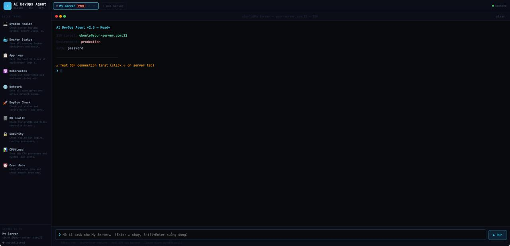

# ⚡ AI DevOps Agent v2.0
### Claude AI + Real SSH + Terminal UI

Ứng dụng DevOps Agent hoàn chỉnh: mô tả task bằng ngôn ngữ tự nhiên → Claude lên kế hoạch → thực thi lệnh thật qua SSH.



---

## 📁 Cấu trúc thư mục

```
devops-agent/
├── package.json            ← root (concurrently)
├── backend/
│   ├── package.json
│   ├── server.js           ← Express + SSH2 + Anthropic proxy
│   └── .env.example
└── frontend/
    ├── package.json
    ├── public/index.html
    └── src/
        ├── index.js
        ├── App.js          ← React UI
        └── api.js          ← API client
```

---

## 🚀 Cài đặt & Chạy

### Bước 1 — Clone / copy project

```bash
# Tạo thư mục và copy các file vào
mkdir devops-agent && cd devops-agent
# (copy toàn bộ cấu trúc trên vào đây)
```

### Bước 2 — Cài Node.js (nếu chưa có)

```bash
# Ubuntu / Debian
curl -fsSL https://deb.nodesource.com/setup_20.x | sudo -E bash -
sudo apt-get install -y nodejs

# macOS
brew install node

# Kiểm tra
node --version   # >= 18
npm --version    # >= 9
```

### Bước 3 — Cài dependencies

```bash
# Backend
cd backend
npm install

# Frontend
cd ../frontend
npm install
```

### Bước 4 — Cấu hình Anthropic API Key

```bash
cd backend
cp .env.example .env
nano .env   # hoặc dùng bất kỳ editor nào
```

Sửa file `.env`:
```env
PORT=3001
ANTHROPIC_API_KEY=sk-ant-api03-...   # ← paste API key của bạn
```

Lấy API key tại: https://console.anthropic.com/settings/keys

### Bước 5 — Chạy Backend

```bash
cd backend
node server.js
```

Bạn sẽ thấy:
```
╔══════════════════════════════════════════╗
║   AI DevOps Agent — Backend v2.0         ║
║   http://localhost:3001                  ║
╚══════════════════════════════════════════╝
```

### Bước 6 — Chạy Frontend (terminal mới)

```bash
cd frontend
npm start
```

Trình duyệt tự mở: http://localhost:3000

---

## 🔑 Cấu hình SSH Server

### Cách 1: Password authentication

Trong UI → click **+ Add Server** → điền:
- **Host**: IP hoặc domain của server
- **User**: SSH username
- **Port**: 22 (default)
- **Auth**: Password → nhập password

### Cách 2: Private Key

Trong UI → click **+ Add Server** → chọn **Private Key** → nhập:
- **Private Key Path**: `~/.ssh/id_rsa`
- HOẶC paste toàn bộ nội dung PEM vào textarea

### Test kết nối

Sau khi add server, click nút **⟳** trên server tab để test SSH connection.

---

## 🧪 Test nhanh với server local (không cần server thật)

Để test mà không cần VPS, bạn có thể SSH vào chính máy mình:

```bash
# Ubuntu / macOS — enable SSH server
sudo apt install openssh-server    # Ubuntu
# hoặc: System Preferences → Sharing → Remote Login (macOS)

# Tạo SSH key nếu chưa có
ssh-keygen -t rsa -b 4096 -f ~/.ssh/id_rsa -N ""
cat ~/.ssh/id_rsa.pub >> ~/.ssh/authorized_keys

# Test
ssh localhost whoami
```

Trong UI: Add server với host `127.0.0.1`, user = username máy bạn, privateKey = `~/.ssh/id_rsa`

---

## 🐳 Docker Compose (tuỳ chọn)

```yaml
# docker-compose.yml
version: "3.8"
services:
  backend:
    build: ./backend
    ports:
      - "3001:3001"
    environment:
      - ANTHROPIC_API_KEY=${ANTHROPIC_API_KEY}
    restart: unless-stopped

  frontend:
    build: ./frontend
    ports:
      - "3000:80"
    depends_on:
      - backend
```

```bash
ANTHROPIC_API_KEY=sk-ant-... docker-compose up -d
```

---

## 🔧 API Endpoints

| Method | Endpoint | Mô tả |
|--------|----------|-------|
| GET | `/api/health` | Backend health check |
| GET | `/api/servers` | Danh sách servers |
| POST | `/api/servers` | Thêm server |
| PUT | `/api/servers/:id` | Cập nhật server |
| DELETE | `/api/servers/:id` | Xóa server |
| POST | `/api/ssh/test` | Test SSH connection |
| POST | `/api/ssh/exec` | Thực thi lệnh SSH |
| GET | `/api/ssh/stream` | SSH streaming (SSE) |
| POST | `/api/claude/plan` | Claude lên kế hoạch |

---

## 💡 Ví dụ task

```
Check server health: uptime, memory, disk usage
Show running Docker containers
Deploy latest code: git pull, restart app service
Check nginx logs for 5xx errors
List all failed systemd services
Show top CPU consuming processes
Check PostgreSQL replication lag
```

---

## 🔒 Bảo mật

- API key nằm hoàn toàn ở backend, không bao giờ expose ra frontend
- SSH credentials lưu in-memory (restart = mất) — thêm database nếu cần persistent
- Nên dùng SSH key thay vì password
- Chạy sau reverse proxy (nginx) với HTTPS trong production

---

## 📦 Stack

| Layer | Tech |
|-------|------|
| AI | Anthropic Claude (claude-sonnet-4) |
| Backend | Node.js + Express |
| SSH | ssh2 (npm) |
| Frontend | React 18 |
| Fonts | JetBrains Mono |
